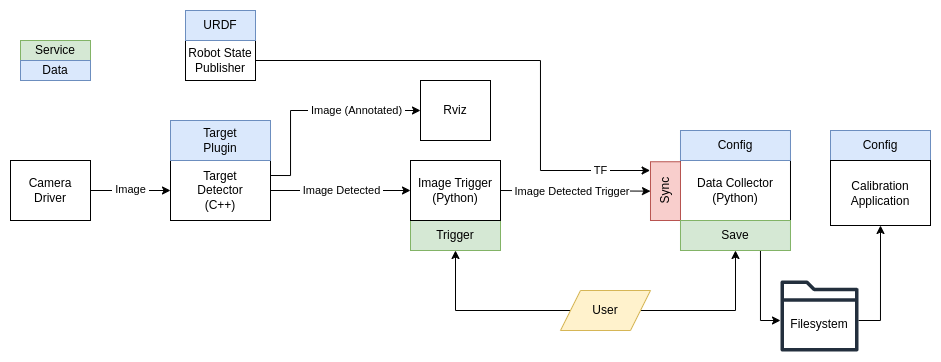

# industrial_calibration_ros
ROS1 utilities for the [`industrial_calibration`](https://github.com/ros-industrial/industrial_calibration) repository

## Architecture


## Nodes
### Target Finder Node
ROS node that subscribes to an image stream and attempts to identify a calibration target in the image.
If the target is identified, it:
  - republishes the original image on a new topic
  - publishes a new image with the target features overlaid on the original image for visualization
  
### Data Collector Node
ROS node that collects data for performing hand-eye calibration with an RGB camera.
This node:
  - subscribes to a stream of images in which a calibration target has been identified
(i.e., the republished image topic from the target finder node)
  - exposes a service for collecting an image/pose observation pair (`/collect`)
  - exposes a service for saving collected image/pose observation pairs to a specified directory (/`save`)

### 3D Data Collector Node
ROS node that collectes data for performing a hand-eye calibration with a combination RGB + point cloud sensor (e.g., Intel Realsense, Photoneo, etc.)
This node:
  - subscribes to a stream of stream in which a calibration target has been identified
(i.e., the republished image topic from the target finder node)
  - subscribes to a point cloud of the 3D scene in which the calibration target has been identified
  - exposes a service for collecting an image/cloud/pose observation triplet (`/collect`)
  - exposes a service for saving collected image/cloud/pose observations to a specified directory (`/save`)

## Build
```commandLine
cd <workspace>
vcs import src < src/industrial_calibration_ros/dependencies.repos
rosdep install --from-paths src -iry
<colcon/catkin> build
```

## Run
```commandLine
roslaunch industrial_calibration_ros data_collection.launch
```
