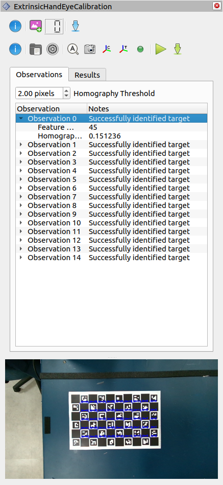

# industrial_calibration_ros2
ROS2 utilities for the [`industrial_calibration`](https://github.com/ros-industrial/industrial_calibration) repository.  It enables the use of the core functionality through ROS2 services, topics, and parameters.  You will also need the core repository to use this code - see the Build section below.

## Architecture


## Nodes
### Data Collector Node
ROS node that collects data for performing hand-eye calibration with an RGB camera.
This node:
  - subscribes to
    - an image topic (`sensor_msgs/Image`) in which a calibration target has been identified (i.e., the republished image topic from the target finder node)
    - TF, to compute the pose from the camera/target mount frame to the moving camera/target frame
      > Note: a calibration observation is acquired whenever a new image is received by the subscriber
  - exposes a service for saving collected image/pose observation pairs to a specified directory (/`save`)

### 3D Data Collector Node
ROS node that collects data for performing a hand-eye calibration with a combination RGB + point cloud sensor
This node:
  - subscribes in a synchronized manner to:
    - an image topic (`sensor_msgs/Image`) in which a calibration target has been identified (i.e., the republished image topic from the target finder node)
    - a point cloud topic (`sensor_msgs/PointCloud2`) of the 3D scene in which the calibration target has been identified
    - TF, to compute the pose from the camera/target mount frame to the moving camera/target frame
        > Note: a calibration observation is acquired whenever a new image/point cloud pair is received by the synchronized subscriber
  - exposes a service for saving collected image/cloud/pose observations to a specified directory (`/save`)

### Target Finder Node
ROS node that subscribes to an image topic (`sensor_msgs/Image`) and attempts to identify a calibration target in the image.
If the target is identified, it:
  - republishes the original image on a new topic
  - publishes a new image with the target features overlaid on the original image for visualization

### Image Trigger Node
ROS node that subscribes to an image topic (`sensor_msgs/Image`) and provides a service (`std_srvs/Trigger`) for republishing that image on command.
This node is intended to act as a software trigger for cameras that publish images continuously or at a frequency faster than the desired calibration observation collection.

## Rviz Integration



This repository provides an Rviz panel for performing data collection for an extrinsic hand eye 2D camera calibration (using the services provided by the [data collection pipeline](launch/data_collection.launch.xml))
and calibration using the extrinsic hand eye calibration widget from `industrial_calibration`.

## Build
```commandLine
cd <workspace>
vcs import src < src/industrial_calibration_ros2/dependencies.repos
rosdep install --from-paths src -iry
colcon build
```

## Run
```commandLine
ros2 launch industrial_calibration_ros data_collection.launch.xml
```
